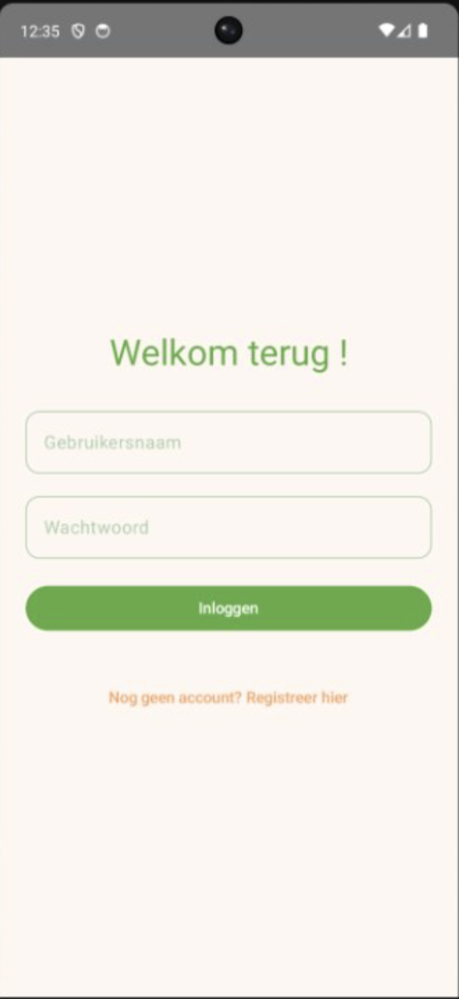
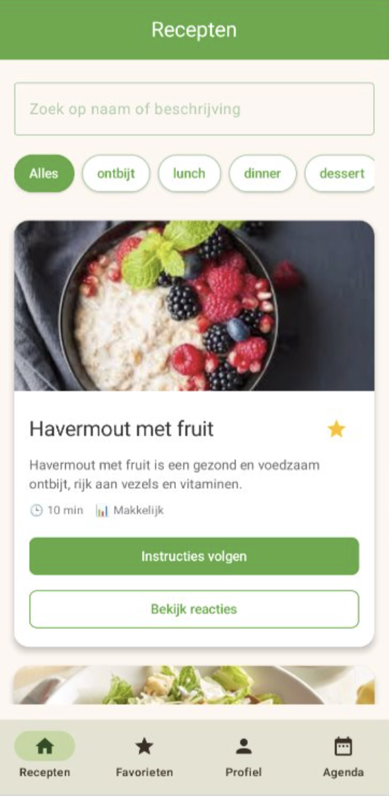
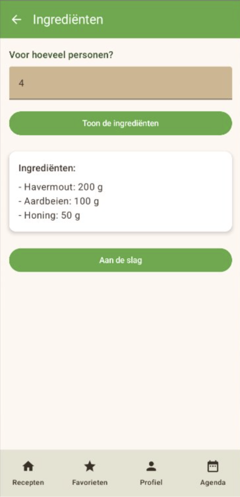
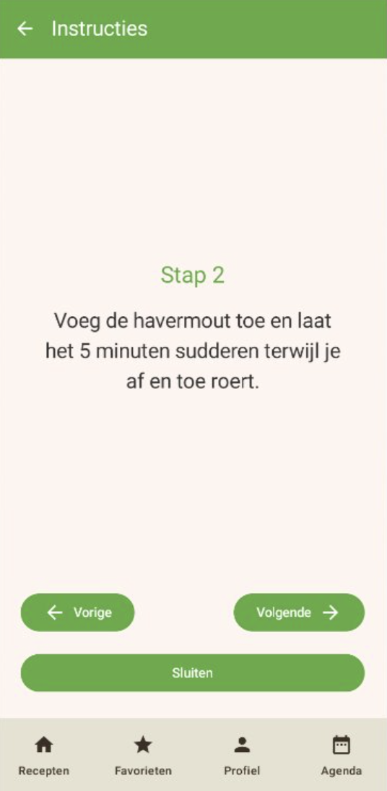
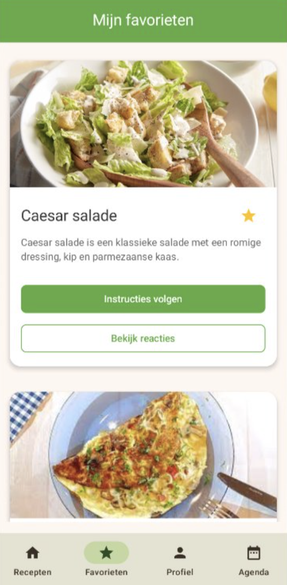
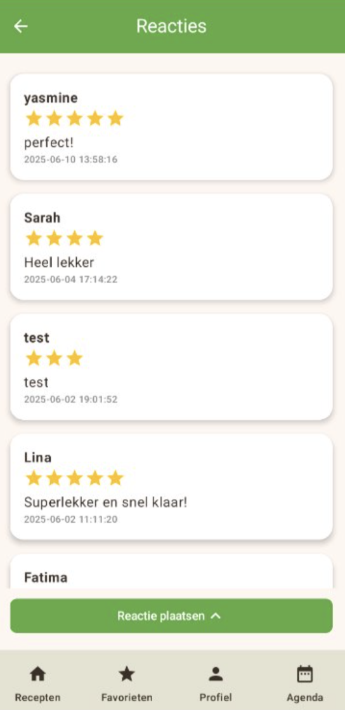
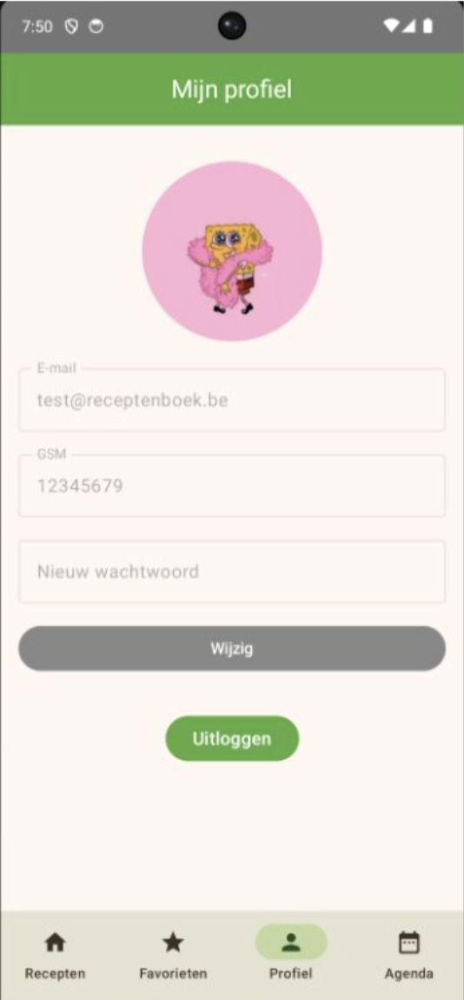
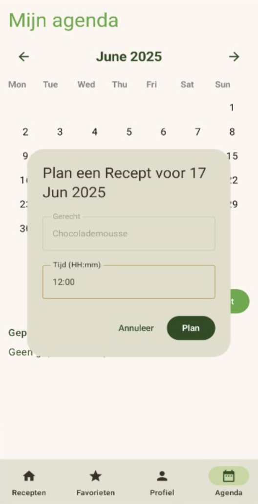
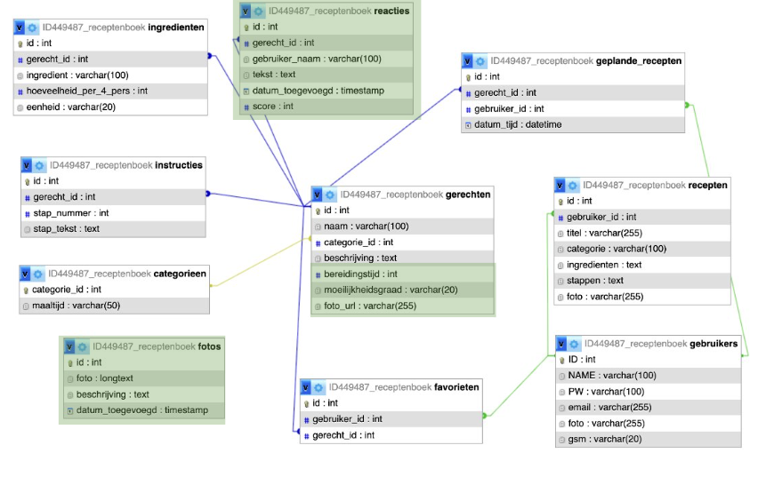

# 📖 Receptenboek Kotlin App  

Dit project is een **Android app gebouwd met Kotlin** voor receptbeheer.  
Het werd ontwikkeld als een **teamproject** door *Yasmine Bouhaoula* en een teamgenoot in het kader van onze opleiding.  

---

## ✨ Functionaliteiten
- 🔎 **Recepten zoeken** op naam en categorie  
- ➕ **Recepten toevoegen** met ingrediënten en stappenplan  
- ❤️ **Favorieten opslaan** voor snelle toegang  
- 🧾 **Ingrediënten per persoon bekijken** met automatische berekening  
- 🗣️ **Stap-voor-stap instructies** met text-to-speech ondersteuning  
- 💡 **Inspiratiemodus**: willekeurig recept als suggestie  
- 💬 **Reactiesysteem**: gebruikers kunnen feedback geven en lezen  
- 📅 **Agenda**: plan recepten in voor specifieke dagen  

---

## 🛠️ Technologieën
- **Kotlin** (Jetpack Compose)  
- **Gradle** build systeem  
- **PHP & MySQL backend** (via phpMyAdmin)  
- **REST API integratie**  
- **Android Studio**  

---

## 📸 Screenshots  

### 🔐 Login & Registratie  
- **Login scherm**: gebruikers kunnen veilig inloggen met gebruikersnaam en wachtwoord.  
- **Registratie scherm**: nieuwe gebruikers kunnen een account aanmaken.  

   

---

### 📑 Receptenoverzicht  
- **Receptenlijst**: recepten worden getoond met foto, beschrijving, bereidingstijd en moeilijkheidsgraad.  
- **Ingrediënten**: berekening per aantal personen.  
- **Instructies**: duidelijke stap-voor-stap begeleiding.  

    

---

### ❤️ Favorieten & Reacties  
- **Favorieten**: sla favoriete recepten op om ze snel terug te vinden.  
- **Reacties**: gebruikers kunnen reviews en scores achterlaten.  

   

---

### 👤 Profiel  
- **Profielpagina**: gebruikers kunnen hun gegevens (e-mail, wachtwoord, gsm) aanpassen en hun profielfoto beheren.  

  

---

### 🗓️ Agenda  
- **Agenda functie**: plan recepten in op specifieke dagen en tijdstippen.  

  

---

## 🗄️ Database ERD  
- **ERD**: toont de database-structuur met tabellen voor gebruikers, recepten, ingrediënten, instructies, favorieten en reacties.  

  

---

